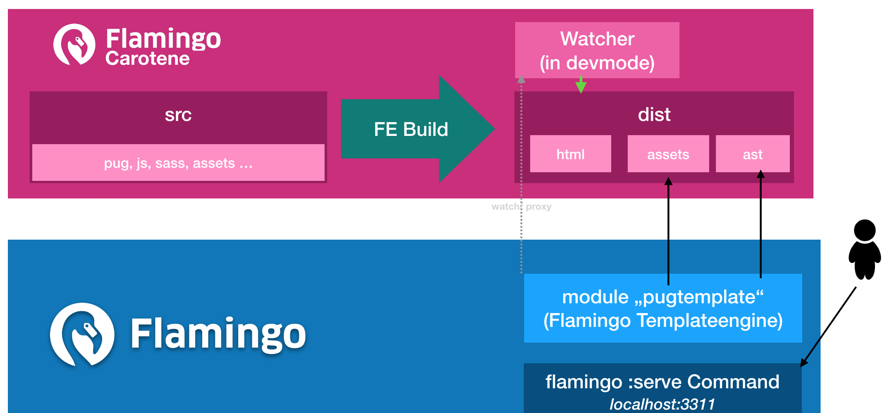

# Flamingo Carotene Introduction

## What is it ?
Flamingo Carotene is an easy to use frontend (-tooling) for projects with the Flamingo framework.

It introduces a modular concept to provide reusable modules and comes with a collection of npm packages, that provide useful features for frontend development.

Flamingo Carotene features pug based templating using [atomic design](03-atomic-design.md) as well as having the option to use webpack and sass for the frontend build.

The basic goals for Flamingo Carotene are:

* Provide independent frontend development with productivity tools (pug, sass, ES6, …)
* Provide a standalone build of the frontend to build JS, CSS, Asset etc. This build logic is not depending on Flamingo and can be developed independently from Flamingo.
* We prefer a styleguide driven development approach, featuring atomic design and following concepts of progressive enhancement.

The basic technical design targets of Flamingo Carotene are:

1. Independent packages: Your are not forced to use "one default" for your project. Instead you can select which feature you want to use. 
The Flamingo Carotene packages are well split (having an individual purpose and following high cohesion low coupling principles).
1. No library lock in: By intention Flamingo Carotene does not force you to use some specific frontend framework (like jquery, vue, angular or react).
1. Freedom: As a result of 2. it is possible to use any javascript framework you might consider useful for your project.

## Getting started:

If you want to use Flamingo Carotene in a Flamingo project - please read  [Getting started with Flamingo Carotene](02-getting-started.md)


## Flamingo Carotene and Flamingo
The generated frontend build artifacts play well together with the Flamingo `pugtemplating`  module.

The following picture illustrates this:



## Flamingo Carotene Modules

Flamingo Carotene Modules are npm packages that can optionally have a Flamingo Carotene specific initialisation file.
They can be added like this:
```bash
npm i [-D] [flamingo-carotene-module-name]
```

The modules generally differ into two types:

 1. modules responsible for the tooling - e.g. to do something in the build process, like webpack.
 1. modules used in the code you will deliver - e.g. to add some behavior to your website, like state manager.

Every module can come with useful exposed configurations, that allow you to configure it to your wishes.

To understand how modules work or if you want to develop and use your own modules read the [how to module](04-flamingo-carotene-modules.md).
